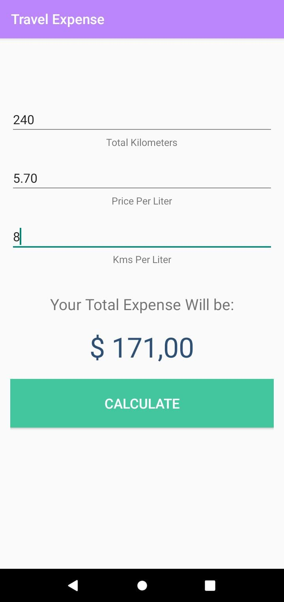

# Travel Expense 🚗💰

An Android app to help you calculate your total travel cost based on distance, fuel efficiency, and fuel price.

## 📱 Features

- Enter trip distance (in kilometers)
- Enter vehicle fuel efficiency (km/l)
- Enter fuel price (local currency per liter)
- Instantly calculate total travel cost
- Clean and intuitive UI
- Compatible with Android 5.0 (API 21) and above

## 🛠️ Tech Stack

- Kotlin
- Android SDK
- AndroidX libraries
- View Binding
- Material Design components

## 📸 Screenshots

> 

## 🚀 Getting Started

1. Clone this repository:

Open the project in Android Studio.

Let Gradle sync the project.

Connect your device or start an emulator.

Click Run ▶️ to launch the app.

✅ Requirements

Android Studio (Hedgehog or newer recommended)

JDK 8 or higher

Gradle 8.0 or higher

Android Gradle Plugin 8.5.1

Internet connection to fetch dependencies

⚠️ Known Issues

The project is not compatible with AGP versions below 8.0.

kotlin-android-extensions is deprecated. View Binding is used instead.

